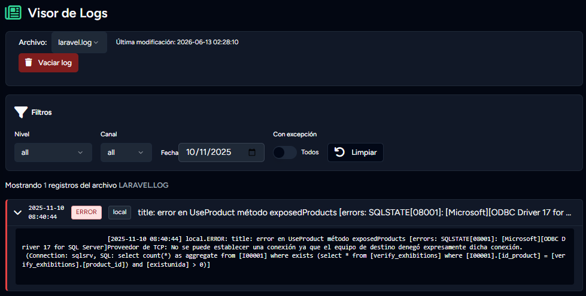
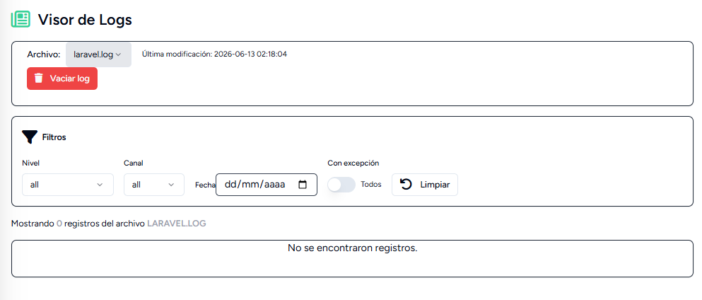
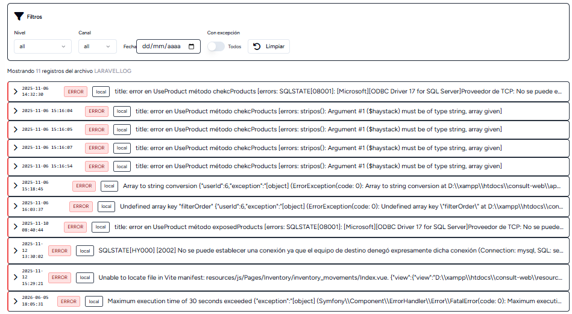
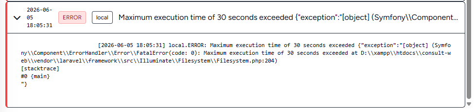

# Laravel Log Viewer


Visualizador de logs para Laravel con soporte para Blade, Inertia y API.

Permite inspeccionar archivos de log, filtrar registros, visualizar excepciones y administrar múltiples archivos de log desde una interfaz sencilla.

<p align="center">
    
</p>

---

## Características

* Lectura de archivos `.log` dentro de `storage/logs`.
* Soporte para múltiples archivos de log.
* Selección dinámica de archivos.
* Filtros por:

  * Nivel.
  * Canal.
  * Fecha.
  * Registros con excepción.
* Soporte para:

  * Blade.
  * Inertia.
  * API JSON.
* Limpieza de archivos de log.
* Middleware configurables.
* Compatible con Spatie Laravel Permission.
* Detección de contexto JSON.
* Detección de excepciones.
* Soporte para logs multilinea.

---

## Requisitos

* PHP 8.1+
* Laravel 10.x
* Laravel 11.x
* Laravel 12.x

---

## Instalación

```bash
composer require edwinylil1/laravel-log-viewer
```

Publicar configuración:

```bash
php artisan vendor:publish --tag=logviewer-config
```

Publicar vistas Blade:

```bash
php artisan vendor:publish --tag=logviewer-views
```

Publicar componentes Vue:

```bash
php artisan vendor:publish --tag=logviewer-vue
```

<p align="center">
    
</p>


<p align="center">
    
</p>

<p align="center">
    
</p>
---

La vista Inertia publicada es únicamente una referencia.

Debe adaptar:

- Layout principal.
- Componentes UI.
- Sistema de diseño.
- Tailwind/Shadcn.

a la estructura de su aplicación.

## Configuración

Archivo:

```php
config/logviewer.php
```

### Log por defecto

```php
'default_log' => 'laravel.log',
```

Archivo mostrado al ingresar al visor.

---

### Middleware de acceso

```php
'middleware' => [
    'web',
    'auth',
],
```

Ejemplos:

```php
'middleware' => [
    'web',
    'auth',
    'permission:view logs',
],
```

```php
'middleware' => [
    'web',
    'auth',
    'role:super-admin',
],
```

```php
'middleware' => [
    'web',
    'auth',
    'can:view logs',
],
```

Compatible con Spatie Laravel Permission.

---

### Middleware para limpieza

```php
'middleware_clear' => [
    'web',
    'auth',
],
```

Ejemplo:

```php
'middleware_clear' => [
    'web',
    'auth',
    'permission:clear logs',
],
```

Permite restringir la limpieza de logs independientemente del acceso de lectura.

---

### Habilitar limpieza

```php
'allow_clear' => true,
```

Si está deshabilitado, la ruta responderá con error HTTP 403.

---

### Logs autorizados para limpieza

```php
'clearable_logs' => [
    'laravel.log',
],
```

Solo los archivos incluidos en esta lista podrán vaciarse.

---

### Prefijo de rutas

```php
'route' => 'logs',
```

Genera rutas como:

```text
/logs/log-viewer
/logs/clear
```

---

### Tipo de interfaz

```php
'ui' => 'blade',
```

Opciones disponibles:

```php
'blade'
'inertia'
'api'
```

---

### Vista Blade

```php
'blade_view' => 'logviewer::index',
```

Vista utilizada cuando `ui = blade`.

---

### Página Inertia

```php
'inertia_page' => 'LogViewer/Index',
```

Componente utilizado cuando `ui = inertia`.

---

### Canales permitidos

```php
'allowed_channels' => [
    'local',
    'stack',
    'daily',
],
```

Si utilizas canales personalizados deberás agregarlos aquí.

---

### Niveles permitidos

```php
'allowed_levels' => [
    'debug',
    'info',
    'notice',
    'warning',
    'error',
    'critical',
    'alert',
    'emergency',
],
```

Basados en los niveles estándar de Monolog.

---

## Rutas

### Visor de logs

```http
GET /logs/log-viewer
```

---

### Limpiar log

```http
DELETE /logs/clear
```

Parámetros:

```json
{
    "log": "laravel.log"
}
```

---

## Filtros disponibles

### Archivo

```http
?log=laravel.log
```

### Nivel

```http
?level=error
```

### Canal

```http
?channel=local
```

### Fecha

```http
?date=2026-06-12
```

### Con excepción

```http
?has_exception=1
```

---

## Ejemplos

### Mostrar errores

```http
/logs/log-viewer?level=error
```

### Mostrar errores del canal local

```http
/logs/log-viewer?channel=local&level=error
```

### Mostrar registros de una fecha

```http
/logs/log-viewer?date=2026-06-12
```

### Mostrar únicamente excepciones

```http
/logs/log-viewer?has_exception=1
```

### Leer otro archivo

```http
/logs/log-viewer?log=test.log
```

---

## Compatibilidad con Spatie Laravel Permission

Configuración:

```php
'middleware' => [
    'web',
    'auth',
    'permission:view logs',
],

'middleware_clear' => [
    'web',
    'auth',
    'permission:clear logs',
],
```

Crear permisos:

```php
use Spatie\Permission\Models\Permission;

Permission::create([
    'name' => 'view logs',
]);

Permission::create([
    'name' => 'clear logs',
]);
```

---

## Arquitectura

El paquete está organizado utilizando:

* DTOs
* Actions
* Services
* Renderers
* Form Requests

### Componentes principales

| Componente          | Responsabilidad                  |
| ------------------- | -------------------------------- |
| LogViewerController | Orquesta las peticiones HTTP     |
| ReadLogsAction      | Lee y filtra registros           |
| ClearLogAction      | Limpia archivos de log           |
| LogParserService    | Parsea el contenido de los logs  |
| LogFileService      | Gestiona archivos de log         |
| RendererFactory     | Resuelve el renderer configurado |
| BladeRenderer       | Renderiza vistas Blade           |
| InertiaRenderer     | Renderiza páginas Inertia        |
| ApiRenderer         | Retorna respuestas JSON          |
| LogFilters          | DTO de filtros                   |
| LogEntry            | DTO de registros                 |

---

## Roadmap

Características previstas para futuras versiones:

* Paginación de registros.
* Búsqueda por texto.
* Descarga de archivos de log.
* Detección automática de canales.
* Soporte mejorado para logs rotados.
* Estadísticas por nivel.
* Visualización enriquecida de contexto JSON.
* Exportación de registros.

---

## Licencia

MIT
